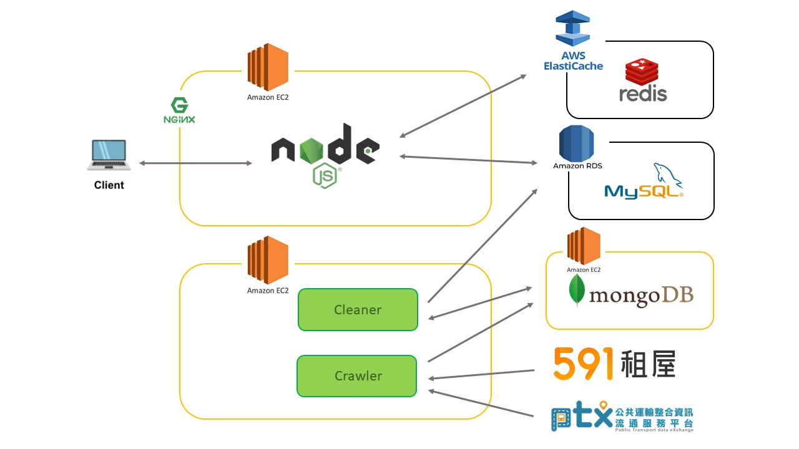

# Find My House

Find My House is an apartment finder,
which features the service of
calculating commuting time by public
transport, and helps commuters find the
ideal apartment.

Website URL: https://find-my-house.site

## 

## Table of Contents

- [Features](#Features)
- [Technologies](#Technologies)
- [Architecture](#Architecture)
- [Database Schema](#Database-Schema)
- [Data Pipeline](#Data-Pipeline)
- [Demo Account](#Demo-Account)
- [Contact](#Contact)

## Features

### Apartment Searching

Drag the pin to set the office location.
Modify the options to fit the user's need.

- Time Period:
  - The time period user commutes
- Commute Time:
  - The commute time expected to spend every day
- Transit Mode
  - Supported transits:
    1. Taipei Metro system
    2. Bus network of Greater Taipei Area
- Maximum Walking Distance
  - The maximum distance commuters willing to walk, including the following:
    1. from the apartment to the first transit station
    2. walking distance during transfer
    3. from the last transit station to office
- House Type
- Budget
- Other Preference

### House Info

- basic house info
- life function nearby

### favorite houses

## Architecture

## Database Schema

## Data Pipeline

## Technologies

### Back-End

- Node.js / Express
- python (crawler)
- RESTful APIs

### Front-End

- HTML
- CSS
- JavaScript
- jQuery
- Bootstrap
- AJAX

### Data Engineering

- Crawler
- Crontab

### DevOps

- Docker

### Database

- MySQL
- MongoDB

### Data Structures

- Directional Graph
- Priority Queue with Binary Heap

### Algorithm

- Dijkstra Algorithm

### Cloud Service (AWS)

- Elastic Compute Cloud (EC2)
- Relational Database Service (RDS)
- Elasticache for Redis

### Third Party APIs

- Google Maps APIs (DrawingManager)
- Public Transport Data Exchange (PTX)

### Networking

- HTTPS
- SSL
- Domain Name System (DNS)
- Nginx

### Test

- Mocha

### Others

- Design Pattern: MVC
- Version Control: Git, GitHub
- Agile: Trello (Scrum)
- Linter: Prettier

### Data Source

- [Public Transport Data Exchange Platform](https://ptx.transportdata.tw)
- [https://rent.591.com.tw](https://rent.591.com.tw/)

## Demo Account

- Account: demo@demo.com
- Password: demo

## Contact

Gideon Pan @ s00971052s@gmail.com
